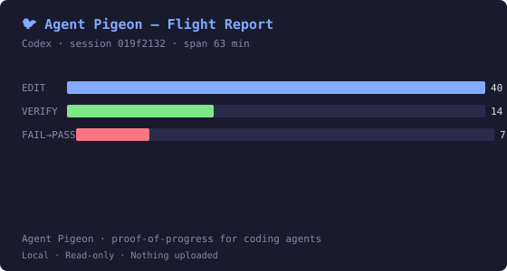

# Agent Pigeon 🐦

> See how your coding agent actually worked.

A tiny local CLI that turns your **Claude Code / Codex** sessions into a
flight report: edits, verification runs, FAIL→PASS loops, and session
comparisons.

```bash
$ agent-pigeon flight

🐦 Agent Pigeon — Codex
  Session span: 63 min · 1 session

  READ      —                   N/A
  EDIT      ██████████████████  40
  VERIFY    ██████              14
  FAIL→PASS ███                 7

🔁 Biggest debugging loop
   FAIL → edit → FAIL → edit → FAIL → edit → FAIL → edit → PASS → edit → FAIL → edit → PASS

Final state
   ✓ recognized verification found

Local · Read-only · Nothing uploaded
```

Local, read-only, no API key, nothing uploaded.

## Why Agent Pigeon?

Coding agents produce a lot of activity. Activity is not the same as work you
can check. Agent Pigeon reads the session history you already have on disk
and answers cheap, factual questions:

- how much did the agent read, edit, and actually run?
- did verification ever fail and then pass (a real FAIL→PASS debugging loop)?
- what did the end of the session look like?
- how do two sessions compare, side by side?

No cloud, no API key, no configuration — and it never writes to your
history.

## Flight

`agent-pigeon flight` inspects **one session** (the most recent coding
session by default) and prints the report above.

- **READ / EDIT / VERIFY bars** — reads, code changes, and *recognized
  verification* (build / test / device commands Agent Pigeon can identify).
- **FAIL→PASS** — the biggest debugging loop: fail, edit, fail, … pass.
- **Most touched file** — where the work concentrated.
- **Longest coding streak** — changes with no recognized verification in
  between. A prompt to inspect, not a verdict.
- **Final state** — whether the last recognized verification passed.

```bash
agent-pigeon flight --session 019f2132   # pick a session by id prefix
agent-pigeon flight --json               # machine-readable facts
```

### Replay — broader history

`agent-pigeon replay` runs the same analysis across **all** your local
sessions and reports corpus-wide counts, unverified implementation
stretches, and recognized FAIL→PASS loops. `--source claude|codex|all`,
`--json`.

```bash
$ agent-pigeon replay

Agent Pigeon — replay

  History scanned               428 sessions
  Sessions with code changes    99
  Implementation attempts       456
  Implementation changes        4,643
  Recognized verification runs  649

Unverified implementation stretches — 13
  Stretches where the agent changed code across 3+ separate turns
  without any recognized verification (build / test / device run).
  · codex session 01a06cb2 · 26 turns · high confidence
  … and 8 more (--json for the full list)

Recognized verification loops — 3
  Verification failed, then passed. Healthy debugging — no warnings for these.
```

## Compare

`agent-pigeon compare <sessionA> <sessionB>` puts two sessions side by
side — factual counts only, no scores and no winner.

```bash
$ agent-pigeon compare 019f2132 01a0cddb

                            Codex 019f2132   vs   Codex 01a0cddb

  Session span              63 min   /   4 h 26 min
  EDIT                      40   /   4
  Recognized verification   14   /   33
  FAIL→PASS shape           FAIL ×4 → edit → PASS → edit → FAIL → edit → PASS   /   —
  Most touched file         —   /   —
  READ (attributed)         N/A   /   N/A

  · Codex ran more recognized verification (33 vs 14).
  · Codex made more implementation edits (40 vs 4).
  Read-only · nothing stored or uploaded
```

Claude Code and Codex sessions can be compared against each other the same
way.

## Share

`agent-pigeon share` prints a self-contained SVG card of the same report to
stdout. Deterministic, local, no network, no external fonts — the file holds
only aggregate counts, short session ids, and display-safe file names.

```bash
agent-pigeon share flight  > flight.svg
agent-pigeon share compare > compare.svg
```



## Install

Requires **Node.js ≥ 20.11**. No repository clone needed.

```bash
npx agent-pigeon flight
```

or install it once and keep the command on your PATH:

```bash
npm install -g agent-pigeon
agent-pigeon flight
```

**Platforms:** tested on **Windows 11** and **Linux (Debian 12, Node 20,
Docker)**. **macOS is untested.**

## Supported agents

| History | Status in v0.1 |
| --- | --- |
| Claude Code (`~/.claude/projects`) | **parsed** |
| Codex (`~/.codex/sessions`, rollout JSONL) | **parsed** |
| Kiro / other agents / other formats | not parsed |

Only those directories are read, and only read-only. Your projects' source
code is never read.

## Privacy

- **Reads:** the history directories above, read-only.
- **Persists:** nothing. Flight, replay, compare, and share create no files,
  no state, no cache (redirect `share` output yourself to keep a card).
- **Transmits:** nothing. There is no network code in any command.
- **Output:** aggregate counts and short session identifiers — no source
  code, no diffs, no commands, no prompts.
- **No API key.** Everything runs on your machine.

## Limitations

- **Recognized verification** means build / test / device commands Agent
  Pigeon can identify. Project-specific checks (custom scripts, smoke runs)
  may be invisible.
- Reports are **prompts to inspect, not verdicts**. Agent Pigeon does not
  know your project's definition of proof, and deliberately produces no
  scores, grades, or rankings of sessions, agents, or models.
- Streak and stretch thresholds (3+ turns/changes) are heuristics, not
  guarantees about a session.
- Session ids are shortened to 8 characters; long sessions show a wall-clock
  *span* (`*` marks spans that include gaps).
- macOS is untested.

## Research / history

The path to v0.1 — including a live VERIFY_FIRST governor that was built,
dogfooded, and **deliberately withheld** because its warnings were not useful
enough — is documented in
[docs/research/SUMMARY.md](docs/research/SUMMARY.md)
(experimental code lives under `experimental/`, not in the npm package).
Release notes: [CHANGELOG.md](CHANGELOG.md).

## License

MIT
