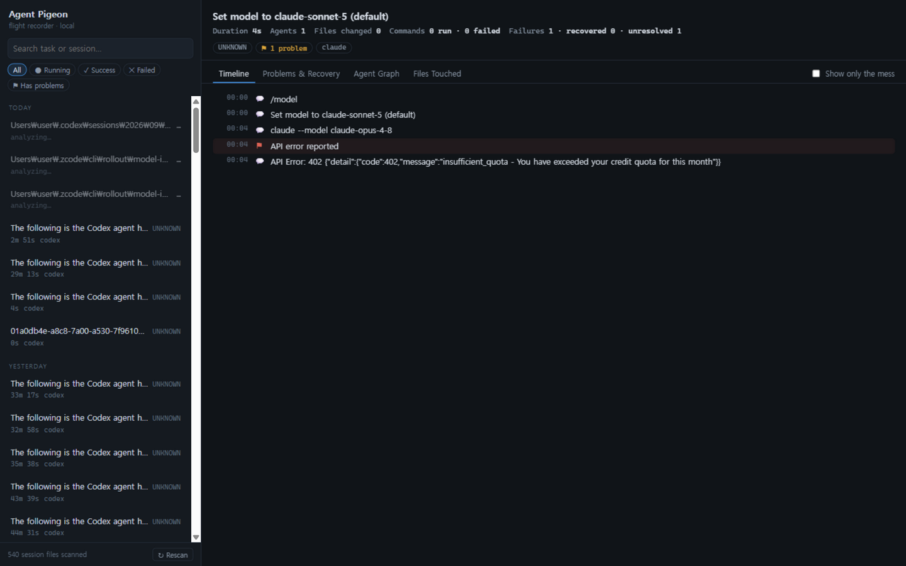
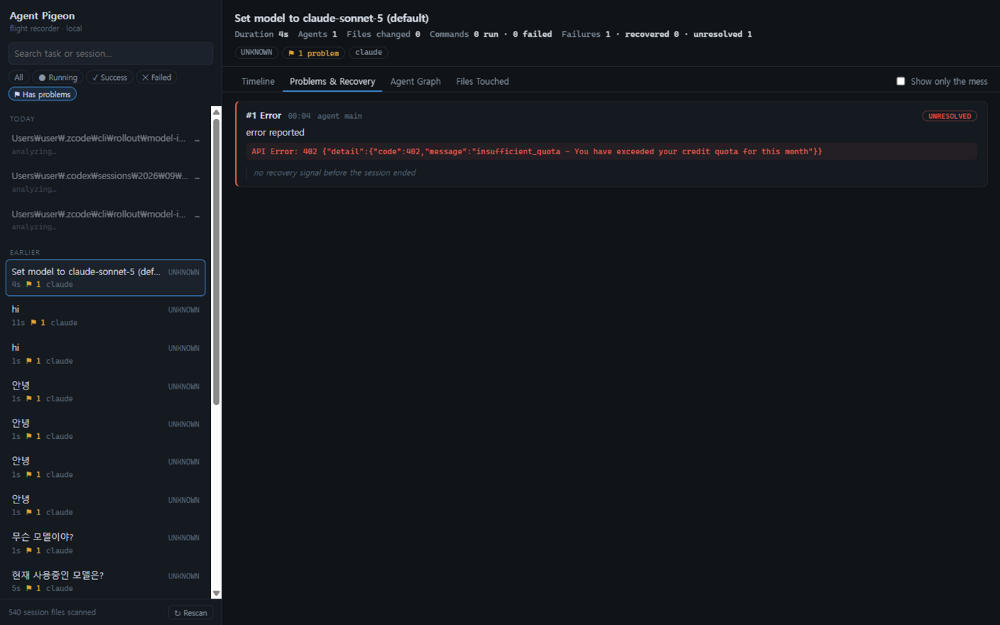

# Agent Pigeon

**A flight recorder for coding agents.**

See what your coding agents changed, where they failed, how they recovered,
and what happened in parallel — in one local UI, no matter which coding tool
produced the session.



**Local-first · Read-only · No account · No telemetry · Nothing uploaded**

## What it does

A one-hour agent session produces thousands of log lines. Agent Pigeon turns
them into an answer to one question: **what happened, and where did it go
wrong?**

- **Timeline** — the session's chronology: files read and changed, commands
  run, tests and builds with their outcomes, all time-stamped.
- **Problems & Recovery** — every test failure, build failure, non-zero
  command and agent error, chained to what the agent did next and to the
  signal that proves recovery (same tests passing, same command succeeding).
- **Show only the mess** — one toggle that hides routine operations and
  leaves only failures, retries and recovery work. *"327 routine operations
  hidden. Problems: 4."*
- **Agent Graph** — parent/child structure for parallel agents (main →
  research / backend / tests), with status, duration and task per agent.
- **Files Touched** — every file the session created, changed or deleted,
  by which agent, and whether it was involved in a failure or recovery.
- **Live sessions** — sessions currently being written show as ● Running and
  update while the agent works.

Everything is derived from observable evidence in your local logs — tool
calls, commands, exit codes, test results. Agent Pigeon never guesses what
an agent "thought" and never sends your code anywhere.

## Supported agents

Support levels are honest: an adapter is only marked FULL when its format
maps losslessly, and limitations are stated, not hidden.

| Agent | Level | Notes |
| --- | --- | --- |
| Pigeon JSONL | **FULL** | Reference format — any tool can emit it (spec below) |
| Codex | **PARTIAL** | Rollout logs; no subagent records; outcomes via exit codes |
| Claude Code | **PARTIAL** | No explicit session end; sidechains grouped under one subagent |
| ZCode | **EXPERIMENTAL** | Reads the model-io rollout debug log; may change between versions |
| OpenCode | UNAVAILABLE | No local session storage found to verify a format against — no adapter was guessed |

## Quick start

Requires **Node.js ≥ 20.11**.

```bash
npm install -g agent-pigeon

# Launch the Flight Recorder UI (http://127.0.0.1:7676)
agent-pigeon ui
```

The UI automatically discovers sessions from Claude Code, Codex and ZCode
local history, plus any directory you pass with `--dir <path>`. Click a
session to inspect it; sessions still being written refresh live.



## CLI

```bash
agent-pigeon ui                    # standalone local web UI
agent-pigeon session <file>        # terminal overview for one session file
agent-pigeon flight                # report for the latest coding session
agent-pigeon compare <A> <B>       # side-by-side comparison of two sessions
agent-pigeon replay                # corpus-wide history analysis
agent-pigeon share flight          # SVG card on stdout
```

Every command is read-only: Agent Pigeon reads your local session files,
computes in memory, and prints. It creates nothing, stores nothing, and
sends nothing.

## The Pigeon Event Format

Any coding tool can participate by appending JSON lines:

```jsonl
{"id":"e1","sessionId":"s1","agentId":"main","type":"SESSION_STARTED","timestamp":"2026-09-24T09:00:00.000Z","source":"my-tool"}
{"id":"e2","sessionId":"s1","agentId":"main","type":"FILE_CHANGED","timestamp":"2026-09-24T09:00:30.000Z","filePath":"src/api.ts"}
{"id":"e3","sessionId":"s1","agentId":"main","type":"TEST_FAILED","timestamp":"2026-09-24T09:01:10.000Z","command":"npm test","status":"error","error":"4 tests failed","metadata":{"testsFailedCount":4}}
{"id":"e4","sessionId":"s1","agentId":"main","type":"TEST_PASSED","timestamp":"2026-09-24T09:02:30.000Z","command":"npm test","status":"ok"}
{"id":"e5","sessionId":"s1","agentId":"main","type":"SESSION_COMPLETED","timestamp":"2026-09-24T09:03:00.000Z","metadata":{"outcome":"success"}}
```

Event types cover the session lifecycle, agent and subagent start/complete
(parent links via `parentAgentId`), messages, tool calls and results, file
read/create/change/delete, command/test/build start and outcome, errors and
checkpoints — each with `id`, `sessionId`, `agentId`, `timestamp`,
`status`, `summary`, and optional `filePath`, `command`, `exitCode`,
`durationMs`, `metadata`. Corrupted lines are skipped, never fatal — see
[`src/pigeon/types.ts`](src/pigeon/types.ts) for the full model and
[`fixtures/pigeon/`](fixtures/pigeon) for complete example sessions.

## How recovery detection works

Deterministic heuristics over evidence — no AI inference:

- A `TEST_FAILED` followed later by `TEST_PASSED` (in the same agent family)
  is **RECOVERED**; the actions in between (files inspected, files changed,
  commands rerun) become the failure's follow-up chain.
- A failed command recovered only when the **same command** later succeeds —
  a different command succeeding proves nothing.
- Weaker correlations (e.g. an error followed by an unrelated green build)
  are shown as **POSSIBLY_RECOVERED**, never overstated. Failures with no
  positive signal are **UNRESOLVED**; while a session is live they are
  **PENDING**.

## Architecture

```
   Coding agents & tools
   Codex · Claude Code · ZCode · your tool (pigeon.jsonl)
                 │
             Adapters  (per-format parsers → one event model)
                 ▼
        Pigeon Event Format
                 │
         Session Processor  (timeline · agent graph · files ·
                 │           failure & recovery detection)
                 ▼
   Independent local UI  (agent-pigeon ui — localhost, zero-dep)
        plus the read-only CLI (session · flight · compare · replay)
```

Core (`src/pigeon/`, `src/adapters/`) knows nothing about HTTP or any editor;
`src/ui/` is a thin, removable boundary. IDE extensions (VS Code, Zed) are
optional future integrations, not the product.

## Privacy

- Local-first by construction: the UI binds to `127.0.0.1` only; there is
  no server, no sync, no telemetry, and no network access at all.
- Read-only over your local agent history (`~/.claude/projects`,
  `~/.codex/sessions`, `~/.zcode/cli/rollout`, plus dirs you pass).
- The UI shows display-safe paths (repo-relative or last segments) and short
  error identities — not file contents, not prompts.
- Nothing is written: no cache, no state, no database.

Agent Pigeon is an independent local tool and does not require or configure
PigeonHub.

## Development

```bash
npm install
npm test        # build + unit tests (core, adapters, processor, server, perf)
npm run ui      # build + launch the local UI
```

The test suite covers event validation, ordering, parent/child agents,
failure and recovery detection, the "problems-only" view, all adapters
(including corrupted-line handling and a 10k-event performance budget), and
the UI server endpoints. Performance: 100 / 1,000 / 10,000-event sessions
process in ~2 / ~6 / ~50 ms respectively.

Windows is tested; macOS and Linux are untested for the 0.2 UI.

## License

MIT
